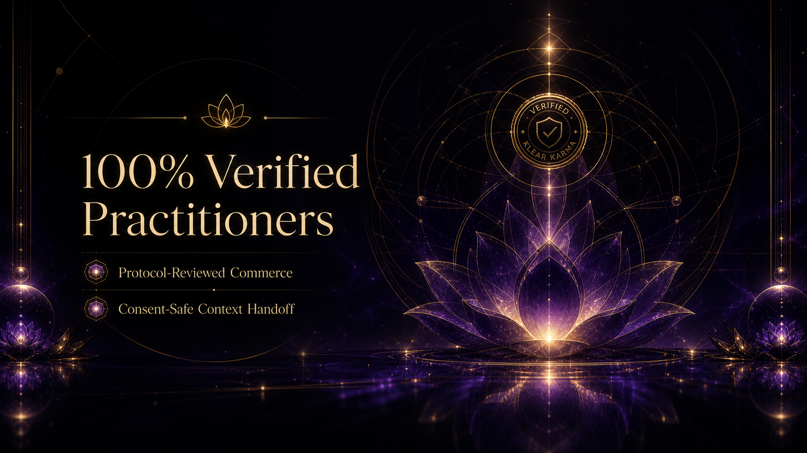
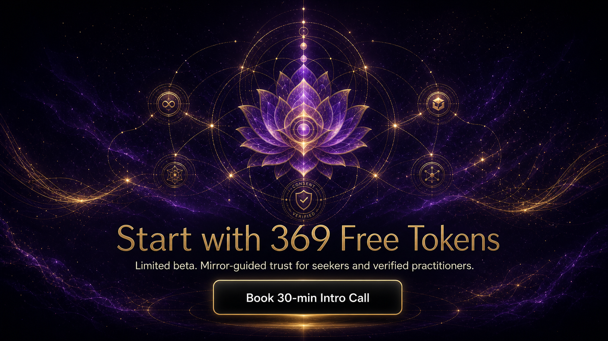

<div align="center">


</div>

<p align="center">
  <a href="https://github.com/Sheshiyer/klear-karma-website-v2/actions"></a>
  <a href="https://github.com/Sheshiyer/klear-karma-website-v2/blob/main/LICENSE"></a>
  
</p>

<p align="center">
  
</p>

---

> **Design-first premium static landing for Klear Karma.**  
> Every major visual section was generated with **GPT Image 2** (via ChatGPT subscription) using the brand kit + wiki references before any code was written. 12-section awwwards-level experience with 0.mp4 hero video, GSAP ScrollTrigger, proper typography, and mirror-guided trust positioning.

<div align="center">
  
</div>

## ✨ Highlights

| ⚡ Design-First | 🪞 GPT Image 2 Assets | 🎯 12-Section Flow |
|-----------------|-----------------------|--------------------|
| All key banners created with GPT Image 2 + brand references *before* HTML/CSS | 6 premium section banners + hero video (0.mp4) | Hero → Category → Problem → How It Works → Features → Trust Layer → Token Economy → Social Proof → Practitioners → Risk Reversal → Final CTA + Email → Footer |

**Key production details:**
- Primary CTAs wired to `https://cal.com/meetshesh/30min` (with UTM tracking)
- Soft email capture as backup conversion
- Hero uses `videos/0.mp4` (autoplay muted loop + poster fallback)
- Floating pills hidden on mobile (≤768px)
- Follows skill-clusters methodology + awwwards/GSAP/typography best practices

## 🖼️ Generated Assets (Design-First)

All section visuals live in `assets/` (and `site/img/`):

- `section-trust-layer.png`
- `section-category.png`
- `section-social-proof.png`
- `section-token-economy.png`
- `section-practitioners.png`
- `section-final-cta.png`
- `hero-video.mp4` (0.mp4 – used in hero)

These were produced with multi-reference prompts against the existing brand kit + wiki content (Mirror Black, Karma Violet, Quiet Gold, lotus geometry, consent seals, reflective mood).

## 🚀 Quick Start

```bash
# Clone
git clone https://github.com/Sheshiyer/klear-karma-website-v2.git
cd klear-karma-website-v2

# Serve locally (any static server)
npx serve site
# or
python3 -m http.server -d site 8080
```

Open `site/index.html` directly or run the above. No build step required (pure static HTML/CSS/JS + GSAP CDN).

## 🏗️ Structure

```
klear-karma-website-v2/
├── site/                 # Production static site (open this)
│   ├── index.html        # 12-section landing
│   ├── css/
│   │   └── base.css      # Typography, awwwards patterns, new section styles, mobile rules
│   ├── js/
│   │   └── index.js      # Video hovers + ScrollTrigger entrances
│   ├── img/              # All generated section banners + existing brand assets
│   └── videos/           # 0.mp4 (hero) + supporting card videos
├── assets/               # Curated design assets for README/docs
└── README.md
```

## 🧠 Methodology & Skills

This site was built following the **skill-clusters closed loop** (triage → spec → design-first asset generation → execute → gate):

- **Design first**: GPT Image 2 generations with brand/wiki references before any layout code
- **Typography**: web-typography + ui-typography rules enforced (curly quotes, proper dashes, optical sizing, fluid clamp, etc.)
- **Motion**: gsap-scrolltrigger + modern-web-design + awwwards-* skills for premium feel
- **Content**: Pulled from wiki (product/overview.md, campaign-copy.md, brand/voice-tone.md)

## 📸 Screenshots & Visuals

The 6 generated section banners are the hero visuals:

<div align="center">
  
  
  <br/>
  
  
  <br/>
  
  
</div>

Hero uses the 6-second `0.mp4` video with elegant overlay and poster fallback.

## 🔗 CTAs & Conversion

- All primary buttons → **https://cal.com/meetshesh/30min** (UTM tagged per placement)
- Final section includes email capture form as soft backup
- Limited beta scarcity language + 299 THB / 299 INR pricing

## 🛠️ Tech

- Pure static (no framework)
- GSAP 3 + ScrollTrigger (CDN)
- Custom design system tokens (Mirror Black, Karma Violet, Quiet Gold)
- Responsive first + reduced-motion respect
- Video hover cards on journey section

## 📦 Deployment

The `site/` folder is ready for any static host (GitHub Pages, Cloudflare Pages, Vercel, Netlify, etc.).

Example GitHub Pages setup:
- Set source to `/site` (or copy contents to root on deploy branch)

## 🤝 Contributing

This is a marketing-facing landing. For changes:

1. Update content from wiki sources when possible
2. Regenerate visuals with GPT Image 2 (design-first) before touching layout
3. Follow typography rules from the loaded web-typography / ui-typography skills
4. Test at multiple breakpoints + with `prefers-reduced-motion`

## 📄 License

Internal / brand asset — all rights reserved.

---

<div align="center">


**Built with ❤️ + design-first discipline**

</div>
